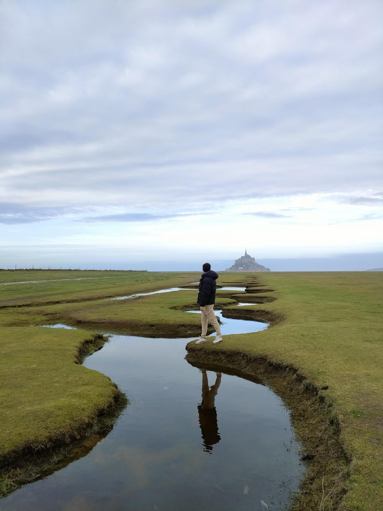
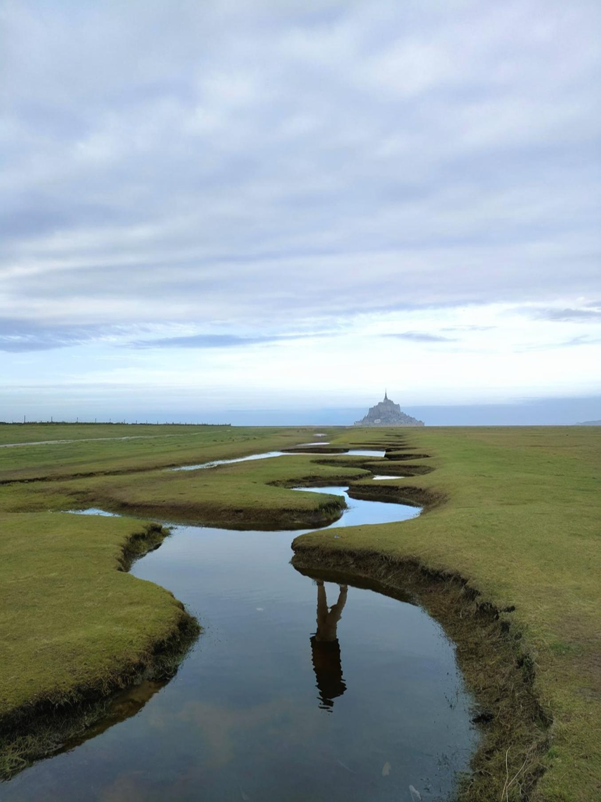
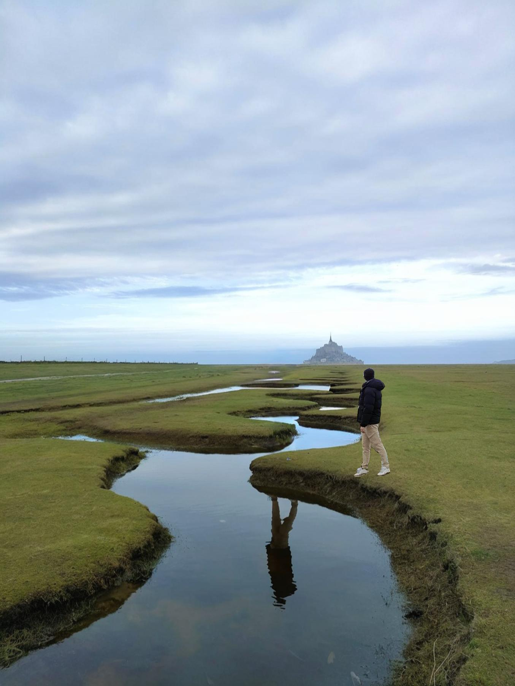

# move_object_inpainting

It is a tool that first perform inpainting. Then it is easy to move the object wherever you want.

For that you just have to perform a square around the object you want to perform inpainting.

Source image                 |  Inpainting image                     |  Moved image          
:---------------------------:|:-------------------------------------:|:-------------------------------------:
   |  | 

## Source image:

## Inpainted image:

## Moved image:

